# 2023년 부여 지역 화재예측 모델 학습 (2023.06)

## 개요
- 부여 시 내의 화재 예방을 위한 시책 시급
- 예방 시책 마련을 위해 부여 시를 격자로 나누어 근 11년 간의 부여 시 데이터를 활용한 머신러닝 모델 학습
- 2020년 강원도 소방본부 구급 출동 AI 예측 대회의 대상 모델 참고
- 학습된 모델을 바탕으로 2023년 하반기 부여 시 내 화재를 격자별로 예측
- 예측 결과를 Kakao map API를 이용해 웹으로 표기 후 Github Pages로 배포
  
## 진행 과정

### (1) 예측 요소 고려
- 예측 지역을 어느 정도로 잡을 것인가?
    - 예측은 강원도 소방본부 구급출동 AI 예측 경진대회의 방식처럼 격자 기반으로 진행
    - 화재 예방 순찰 활동 범위를 고려하여 변 길이 약 2km의 정사각형 격자를 예측 범위로 결정
    - 지역을 변 길이 약 2km의 정사각형 격자로 구분하기 위해 부여 시 전 지역을 15x15 격자로 구분
    - 예측 위도 및 경도가 격자에 포함 시 예측에 성공한 것으로 간주
    - 부여 시 격자 \
        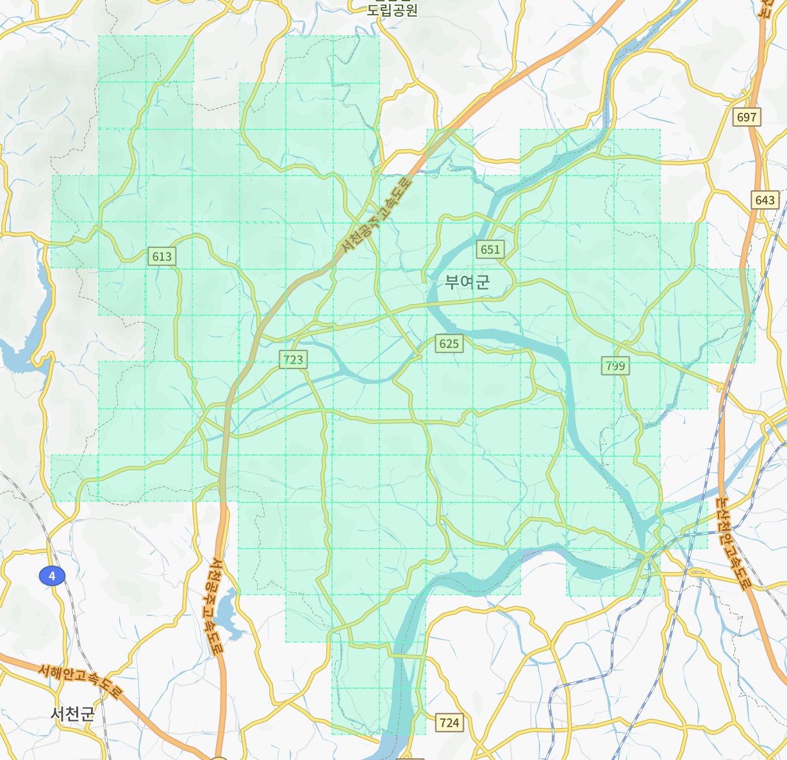
- 사용할 데이터는 무엇인가?
   - 실제 부여 시 소방청에 근무하는 소방사의 조언에 따라 데이터 선정 (이후 데이터 분석을 통해 실제 사용 데이터 선정)
      - 실제 부여 시 화재 발생 데이터: 화재 위치 및 화재의 원인 분석
      - 부여 시 내 특수용도의 건물 데이터: 특정 건물에서 화재가 많이 날 것임을 고려, 또한 건물의 위치를 통해 주변 환경을 대략적으로 파악할 수 있음을 고려
      - 부여 시 내 인구지수 및 노인인구지수 데이터: 인구지수가 높은 지역에서 화재가 많이 발생하며 특히 농업 지역에서 노인들이 쓰레기를 태울 때 화재가 많이 발생할 수 있다는 점을 고려
      - 부여 시 내 기후 데이터: 기후는 화재 발생에 많은 영향을 끼치므로 이를 고려
- 머신러닝 예측 모델은 무엇을 사용할 것인가?
    - 앙상블을 고려할 수도 있으나 작업의 단순화를 위해 로지스틱 회귀, K 최근접, 결정 트리, 랜덤 포레스트, 그라디언트 부스팅 5가지 모델로 학습하여 가장 좋은 모델로 사용

### (2) 부여 시 화재 데이터 분석
- 부여 시 소방청에서 제공한 11년 간의 화재 데이터 전처리
- Kakao map API를 이용하여 주소를 위도 및 경도로 변환
- 부여에서 벗어나는 화재 발생 데이터 삭제
- 위도 및 경도를 0~14의 정수 좌표를 가지는 15x15 좌표계로 변환
- 화재 발생 좌표 그래프 \
    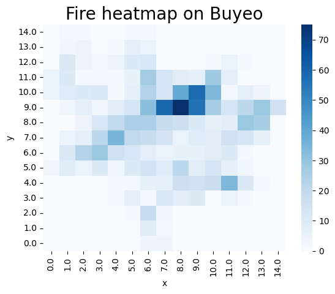
- 화재 별 원인 구분을 통해 어떤 종류의 화재가 많이 발생하는지 분석: 임야, 주택, 비닐하우스의 화재 비율 상위권
- 부여 시는 농업 지역이 많으나 임야에 대한 정보가 부족하므로 화재 발생 데이터를 통해 임야 지역 파악, 마찬가지로 비닐하우스에 대한 정보가 특수건물 정보에 포함되지 않으므로 화재 발생 데이터를 통해 비닐하우스 지역 파악
- 임야 지역 화재 좌표 그래프 \
    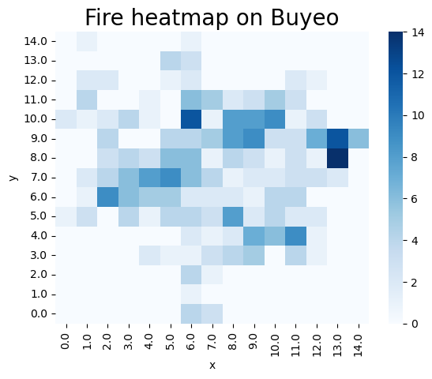
- 월별 및 일별 화재 발생 빈도 분석: 건조한 겨울 및 봄의 화재 발생 빈도가 높은 점을 고려 \
    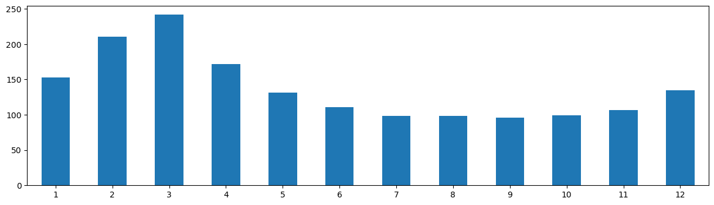 \
    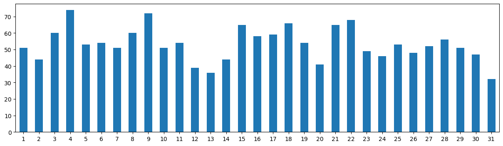

### (3) 부여 시 인구지수 및 노인인구지수 데이터 분석
- 부여군청에서 제공한 11년 간의 지역별(리) 거주 인구수 및 60세이상노인인구수 데이터 전처리
- 인구수 기반으로 지역별로 다음 수치 산출
    - 해당 지역 60세이상노인비율 = 해당 지역 60세이상노인인구수 / 해당 지역 전체인구수
    - 해당 지역 인구수비율 = 해당 지역 인구수 / 부여시 전체인구수
    - 해당 지역 60세이상노인인구수비율 = 해당지역 60세이상노인인구수 / 부여시 전체 60세이상노인인구수
- 각 지역별(리) 위도 및 경도를 좌표계로 변환한 후 겹치는 부분의 수치의 평균 산출
- 좌표별 인구수비율 분포 그래프 \
    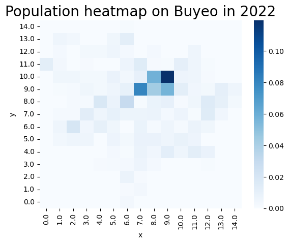
- 좌표별 60세이상노인인구수비율 분포 그래프 \
    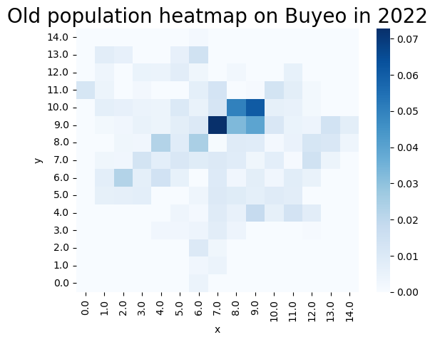
  
### (4) 부여 시 건물 데이터 분석
- 부여군청에서 제공한 11년 간의 부여시 특수건물 데이터 전처리
- 철거구분, 존치기간, 건물신고일, 취소일자 컬럼 이용하여 건물의 실질적철거일 명시
- 건물 주소 정제하여 위도 및 경도 추출
- 건물의 용도 중 가장 많은 창고, 축사, 균사로 컬럼 정제
- 건물의 위도 및 경도를 좌표계로 변환한 후 좌표계 그래프로 표시
- 좌표별 창고 분포 그래프 \
    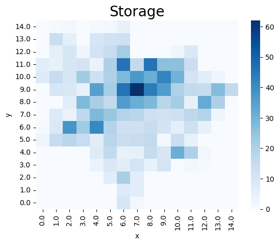
- 좌표별 축사, 균사 그래프 \
    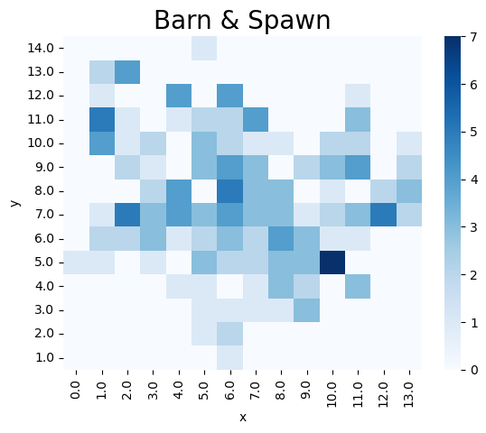

### (5) 부여 시 날씨 데이터 분석
- 기상청에서 제공한 11년 간의 부여 날씨 데이터 전처리
- 화재에 영향이 많다고 여겨지는 기온, 상대습도, 강수량, 풍속 사용
- 결과적으로 평균기온, 최저기온, 최고기온, 평균 상대습도, 일강수령, 평균 풍속을 피쳐로 선택
  
### (6) 데이터 종합 및 전처리
- 최종적으로 좌표별 월 화재 예측을 진행
- 부여의 좌표 그래프 \
    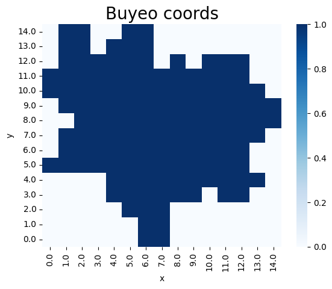
- 날씨 데이터는 월별로 평균을 내서 사용
- 부여 시 내의 대략적인 임야 지역 파악을 위해 좌표별 임야 화재 횟수 사용
- 부여 시 내의 대략적인 비닐하우스 지역 파악을 위해 좌표별 비닐하우스 화재 횟수 사용
- 11년 간의 모든 월 날짜를 생성한 후 날짜에 맞는 데이터 컬럼 추가
- 최종 컬럼: 월, x, y, .인구수비율, 60세이상노인인구수비율, 창고개수, 축·균사개수, 평균기온, 최저기온, 최고기온, 평균상대습도, 일강수량, 평균풍속, 임야화재횟수, 비닐하우스화재횟수, 총 화재횟수
- 날짜를 제외한 나머지 컬럼은 MinMaxScaler로 스케일링 진행
  
### (7) 화재예측 모델 학습
- 화재발생여부 막대그래프 \
    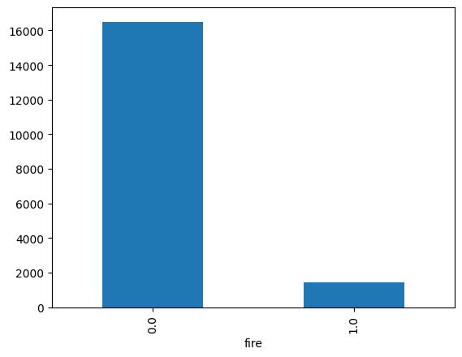
- 화재발생 라벨이 화재가 발생하지 않은 라벨에 비해 현저히 적은 비율 → Random undersampling이나 SMOTE oversampling을 통해 라벨 수 맞추기
- Random undersampling: 라벨 수가 많은 클래스를 무작위 샘플링으로 라벨 수가 적은 쪽과 라벨 수 맞추는 방법
    - Random oversampling 후 correlation matrix \
        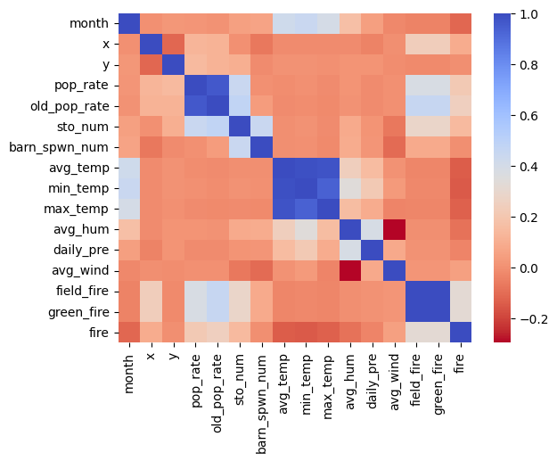
    - 모델 학습 결과 
        | 평가지표/알고리즘 | 로지스틱 회귀 | K 최근접 | 결정 트리 | 랜덤 포레스트 | 그라디언트 부스팅 |
        | ----------------- | ------------- | -------- | --------- | ------------- | ----------------- |
        | F1 score          | 64.95%        | 62.75%   | 67.09%    | 68.42%        | 68.87%            |
        | ROC AUC score     | 0.71382       | 0.62195  | 0.65407   | 0.66671       | 0.67664           |
        | 정확도            | 68.39%        | 63.21%   | 67.88%    | 68.05%        | 68.91%            |
- SMOTE oversampling: 라벨 수가 적은 클래스를 분포에 맞춰 생성하여 라벨 수가 많은 쪽과 라벨 수 맞추는 방법
    - SMOTE oversampling 후 correlation matrix \
        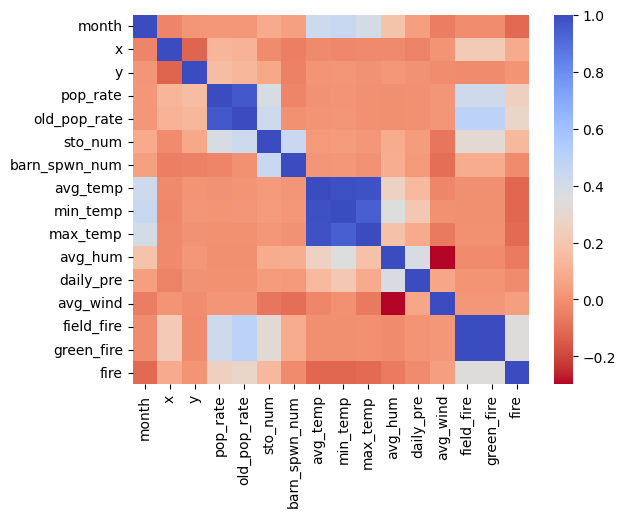
    - 모델 학습 결과
        | 평가지표/알고리즘 | 로지스틱 회귀 | K 최근접 | 결정 트리 | 랜덤 포레스트 | 그라디언트 부스팅 |
        | ----------------- | ------------- | -------- | --------- | ------------- | ----------------- |
        | F1 score          | 65.80%        | 92.34%   | 90.18%    | 94.48%        | 93.29%            |
        | ROC AUC score     | 0.73855       | 0.92029  | 0.90846   | 0.95025       | 0.94233           |
        | 정확도            | 70.98%        | 84.13%   | 83.59%    | 90.42%        | 89.97%            |
- 최종적으로 SMOTE oversampling의 랜덤 포레스트 모델을 화재 예측 모델로 채택

### (8) 2023.01~2023.06 화재예측결과 비교
- 예측범위 및 실제화재좌표 비교 그래프 \
    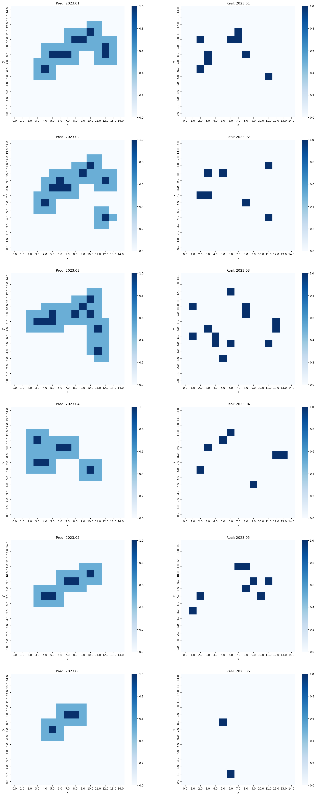
- 전체 화재 중 예측좌표에서 정확히 화재가 발생한 정확도: 2.17%
- 전체 화재 중 예측좌표 및 그 주변에서 화재가 발생한 정확도: 45.65%

### (9) Github pages 기반 화재예측결과 웹뷰
- 카카오맵 API를 기반으로 예측결과를 Github pages로 볼 수 있도록 제공
- 화재예측서비스 (https://sihan827.github.io/Fire-Prediction/) \
    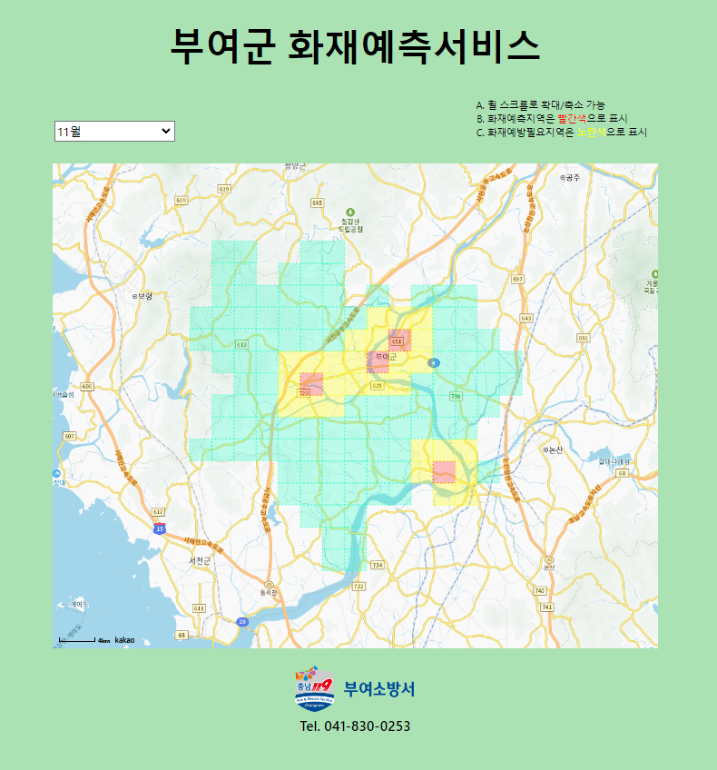
- 예측 결과를 바탕으로 화재예측좌표 및 주변지역을 순찰하는 시책을 2023.07~2023.12 동안 시행

### (10) 시책 시행 후 2023.07~2023.12 화재예측결과 비교
- 예측범위 및 실제화재좌표 비교 그래프
    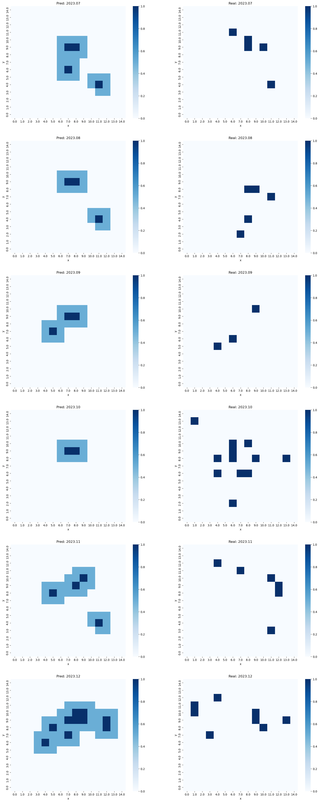
- 전체 화재 중 예측좌표에서 정확히 화재가 발생한 정확도: 10.26%
- 전체 화재 중 예측좌표 및 그 주변에서 화재가 발생한 정확도: 46.15%
- 07월~12월에서 11년 동안의 월별 화재횟수 평균 vs. 2022년 월별 화재횟수 vs. 2023년 월별 화재횟수 그래프 \
    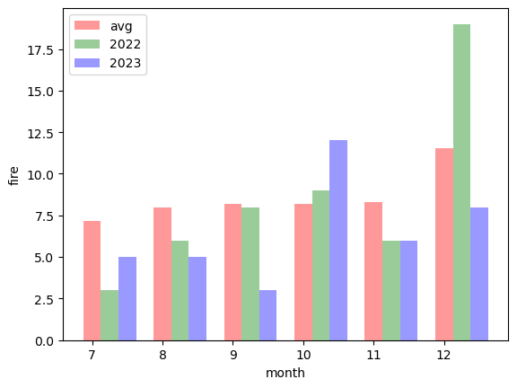
- 시책 시행 후 2022년에 비해 07~12월의 화재 12건이 감소
